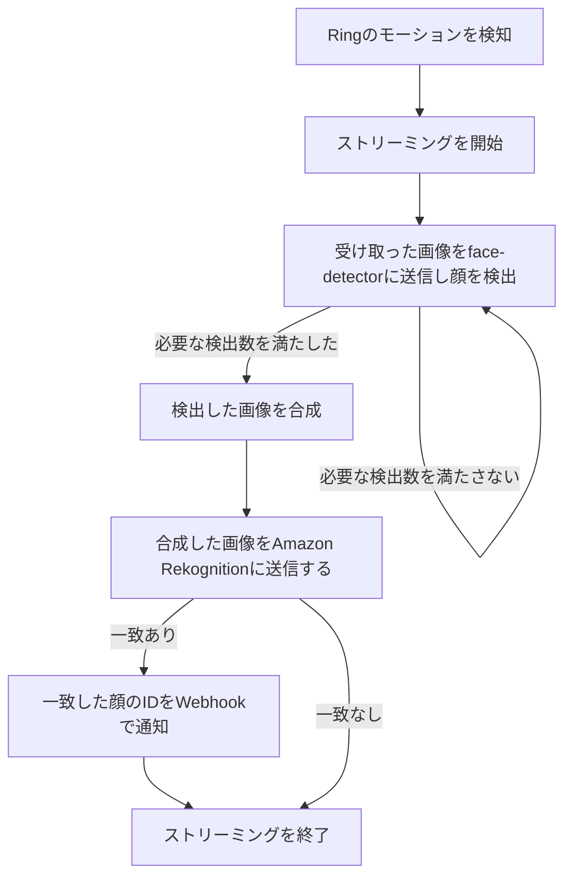

# Ring Face Recognition

## 概要

Ring Doorbellで顔認識するためのアプリケーションです。

## フロー

## リンク

- [Face Detector](https://github.com/nana4rider/face-detector)
- [Amazon Rekognition API SearchFacesByImageCommand](https://docs.aws.amazon.com/AWSJavaScriptSDK/v3/latest/client/rekognition/command/SearchFacesByImageCommand/)
