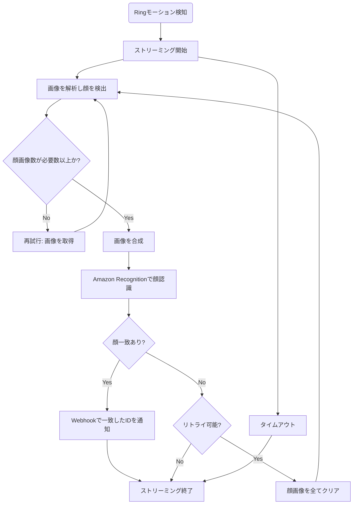

# Ring Face Recognition

[](LICENSE)


## 概要

Ring Doorbellで顔認識するためのアプリケーションです。

## フローチャート



- AWSのコストを抑えるためにFace Detectorを使ってローカルでざっくり検出させています
- 閾値未満と顔見検出はストリーミング開始直後の荒い画像が原因の可能性が高いのでリトライしています

## 使い方

### 認証

```sh
# 取得したリフレッシュトークンを .refreshToken へ保存します (""は不要)
npm run auth
```

### Native

```sh
npm install
npm run build
node --env-file=.env dist/index
```

### Docker

```sh
# --net=hostの方が安定する
docker run -d \
  --net=host \
  --name ring-face-recognition \
  -v $(pwd)/.refreshToken:/app/.refreshToken \
  -p 3000:3000 \
  --env-file .env \
  --restart always \
  ghcr.io/nana4rider/ring-face-recognition:latest
```

> [!TIP]
> 必要な環境変数については[こちら](src/env.ts)をご確認ください。
>
> ストリーミングを安定させるため、 [`host` ネットワーク・モード](https://docs.docker.jp/network/host.html)の利用を推奨します。

## リンク

- [Face Detector](https://github.com/nana4rider/face-detector)
- [Amazon Rekognition API SearchFacesByImageCommand](https://docs.aws.amazon.com/AWSJavaScriptSDK/v3/latest/client/rekognition/command/SearchFacesByImageCommand/)
