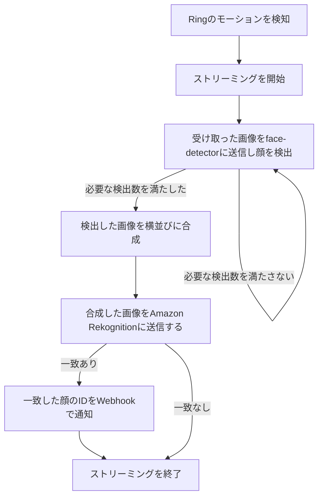

# Ring Face Rekognition

Ring Doorbellで顔認識するためのアプリケーションです。

### フロー

### リンク

- [Face Detector](https://github.com/nana4rider/face-detector)
- [Amazon Rekognition API SearchFacesByImageCommand](https://docs.aws.amazon.com/AWSJavaScriptSDK/v3/latest/client/rekognition/command/SearchFacesByImageCommand/)
