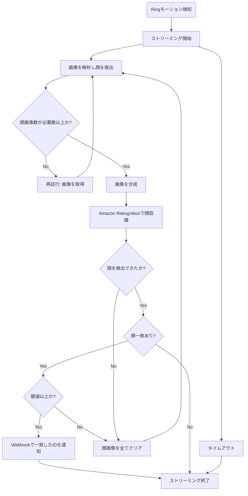

# Ring Face Recognition

[](LICENSE)


## 概要

Ring Doorbellで顔認識するためのアプリケーションです。

## フローチャート



- AWSのコストを抑えるためにFace Detectorを使ってローカルでざっくり検出させてます
- 閾値未満と顔見検出はストリーミング開始直後の荒い画像が原因の可能性が高いのでリトライしています

## 使い方

必要な環境変数については[こちら](https://github.com/nana4rider/ring-face-recognition/blob/main/src/env.ts)をご確認ください。

### 認証

```sh
# 取得したリフレッシュトークンを .refreshToken に保存
npm run auth
```

### Production

```sh
npm install
npm run build
node dist/index
```

### Development

```sh
npm install
npm run dev
```

### Docker

```sh
# --net=hostの方が安定する
docker run -d \
  --net=host \
  --name ring-face-recognition \
  -v $(pwd)/.refreshToken:/app/.refreshToken \
  -p 3000:3000 \
  --env-file .env \
  --restart always \
  nana4rider/ring-face-recognition:latest
```

## リンク

- [Face Detector](https://github.com/nana4rider/face-detector)
- [Amazon Rekognition API SearchFacesByImageCommand](https://docs.aws.amazon.com/AWSJavaScriptSDK/v3/latest/client/rekognition/command/SearchFacesByImageCommand/)
